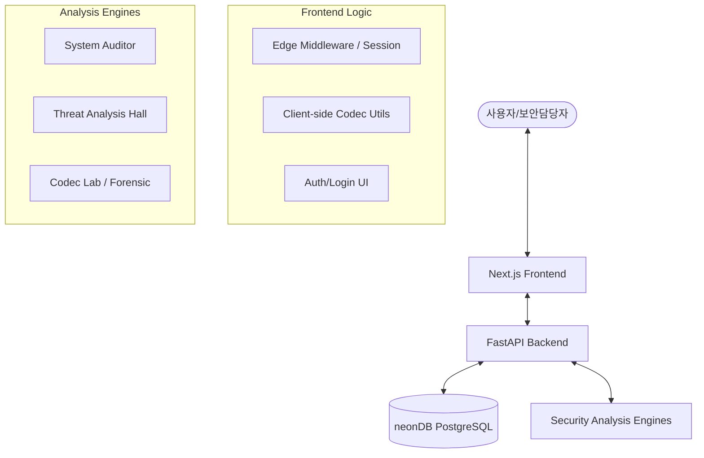

# NTAV SecuLab V2.0 - "Never Trust, Always Verify"


## 🛡️ 프로젝트 개요

**NTAV SecuLab V2.0**은 제로 트러스트(Zero Trust) 보안 철학인 **"Never Trust, 단 한줄의 코드도 Always Verify"**를 기반으로 설계된 차세대 지능형 보안 분석 플랫폼입니다. 인프라 무결성 점검, 악성 위협 분석, 포렌식 유틸리티 및 관리자 관제 기능을 통합하여 제공합니다.

### 🌟 V2.0 주요 업데이트 사항 (2026.03)

- **통합 인증 시스템 (Auth)**: Framer Motion 기반의 하이테크 UI를 통해 대시보드 접근을 통제하는 별도의 `/login` 인증 모듈 분리.
- **라우트 보호 (Route Protection)**: Next.js Edge Middleware를 활용하여 1시간(`3600s`) 제한의 `ntav_session` 클라이언트 사이드 쿠키를 발급 및 검증. 무인가된 접속 원천 차단.
- **코덱 연구소 (Codec Lab) 고도화**: Base64, HEX, URL, UTF-8 및 커스텀 패킷 파싱 로직을 서버에 전송하지 않고 브라우저 Native 레벨(Client-Side)에서 즉시 처리(10ms 이하)하도록 최적화.

## 🏗️ 시스템 아키텍처 (Architecture)

본 프로젝트는 유지보수성과 확장성을 위해 **모듈형 모노레포(Modular Monorepo)** 구조를 채택하고 있습니다.



### 1. Frontend (Next.js)

- **Framework**: Next.js 14+ (App Router)
- **Language**: TypeScript
- **Styling**: Tailwind CSS & Framer Motion (Glassmorphism, 사이버네틱 UI)
- **Security**: Next.js Middleware 기반 `ntav_session` 쿠키 기반 라우트 보호
- **Features**: 세션 관리(1시간 단위 토큰), 실시간 대시보드, 인터랙티브 분석 리포트, 브라우저 로컬 데이터 코덱 연산

### 2. Backend (FastAPI)

- **Framework**: FastAPI (Python 3.10+)
- **ORM**: SQLAlchemy
- **Database**: neonDB (Serverless PostgreSQL)
- **Security**: JWT 기반 인증 및 RBAC API (진행 중), Audit Logging

### 3. Infrastructure (Vercel & Docker)

- **Vercel**: 서버리스 애플리케이션으로 배포 (Next.js & FastAPI 기반)
- **GitHub Actions**: Push 시 Vercel로 자동 배포되는 CI/CD 파이프라인 구축
- **Docker Compose**: 로컬 개발 환경을 위해 컨테이너화 지원

## 📂 디렉토리 구조 (Directory Structure)

```text
/
├── .github/workflows/      # CI/CD 파이프라인 (Vercel Deploy)
├── api/                    # Vercel 서버리스 입구 (FastAPI Wrapper)
├── backend/                # FastAPI 서버 및 비즈니스 로직
├── src/                    # Next.js 프론트엔드 메인
│   ├── app/                # App Router (login, /)
│   ├── components/         # 대시보드 및 각 모듈 UI (CodecLab 등)
│   ├── lib/                # 유틸리티 (codecUtils.ts)
│   └── middleware.ts       # 라우트 프로텍션 미들웨어
├── vercel.json             # Vercel 라우팅 및 빌드 설정
├── docker-compose.yml       # 로컬 개발용 설정
└── README.md               # 프로젝트 매뉴얼
```

## 🚀 배포 및 운영 (Deployment)

### Vercel 자동 배포 (CI/CD)

GitHub의 `main` 브랜치에 코드를 푸시하면 자동으로 Vercel에 배포됩니다. 이를 위해 다음 Secrets를 GitHub 레포지토리에 등록해야 합니다:

1. `VERCEL_TOKEN`: Vercel 계정에서 생성한 토큰
2. `VERCEL_ORG_ID`: Vercel 프로젝트의 Team ID 또는 User ID
3. `VERCEL_PROJECT_ID`: Vercel 프로젝트 ID

### 로컬 개발 환경 실행

```bash
# Docker Compose를 이용한 전체 구동
docker-compose up --build
```

---
