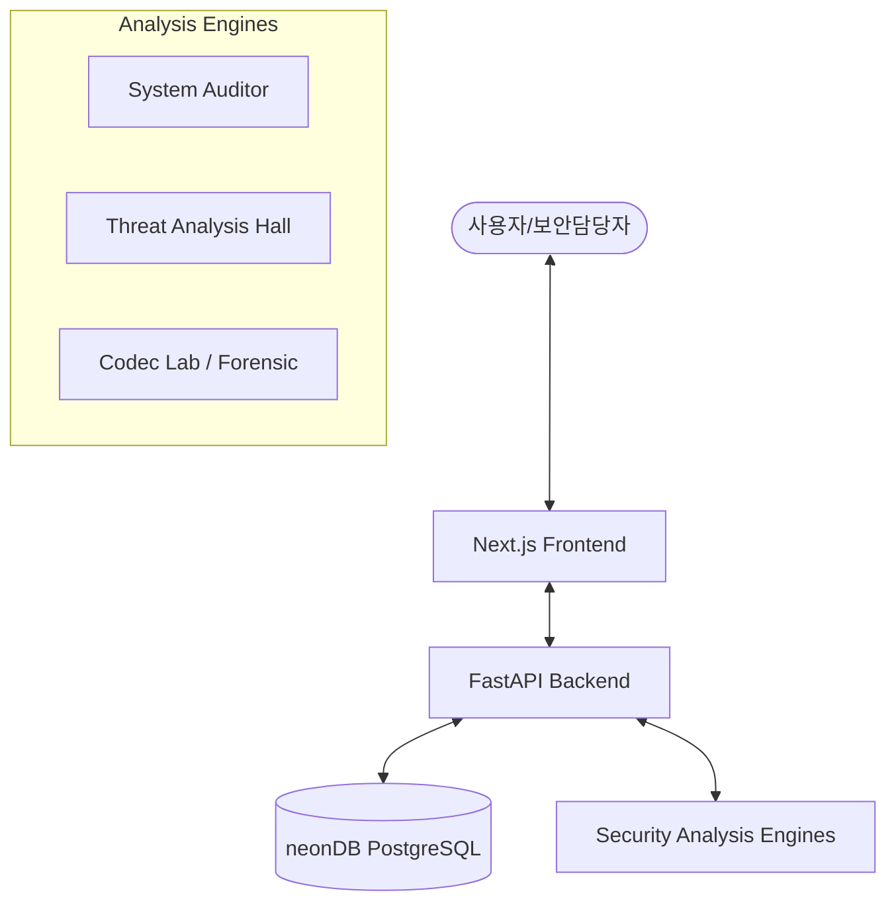

# NTAV SecuLab V2.0 - "Never Trust, Always Verify"


## 🛡️ 프로젝트 개요
**NTAV SecuLab V2.0**은 제로 트러스트(Zero Trust) 보안 철학인 **"Never Trust, Always Verify"**를 기반으로 설계된 차세대 지능형 보안 분석 플랫폼입니다. 인프라 무결성 점검, 악성 위협 분석, 포렌식 유틸리티 및 관리자 관제 기능을 통합하여 제공합니다.

## 🏗️ 시스템 아키텍처 (Architecture)

본 프로젝트는 유지보수성과 확장성을 위해 **모듈형 모노레포(Modular Monorepo)** 구조를 채택하고 있습니다.



### 1. Frontend (Next.js)
- **Framework**: Next.js 14+ (App Router)
- **Language**: TypeScript
- **Styling**: Tailwind CSS & Framer Motion (Glassmorphism UI)
- **Features**: 실시간 대시보드, 인터랙티브 분석 리포트, 다크 모드 UI

### 2. Backend (FastAPI)
- **Framework**: FastAPI (Python 3.10+)
- **ORM**: SQLAlchemy
- **Database**: neonDB (Serverless PostgreSQL)
- **Security**: JWT 기반 인증 및 RBAC (준비 중), Audit Logging

### 3. Infrastructure (Docker)
- **Docker Compose**: 전체 시스템을 한 번의 명령으로 구동할 수 있도록 컨테이너화
- **Monitoring**: Prometheus & Grafana 연동 (확장 예정)

## 📂 디렉토리 구조 (Directory Structure)

```text
/
├── backend/                # FastAPI 서버 및 비즈니스 로직
│   ├── models/             # DB 스키마 및 데이터 모델
│   ├── routes/             # API 엔드포인트 정의 (System, Analyze, Forensic, Admin)
│   ├── services/           # 분석 엔진 로직 (Scoring, MITRE Mapping 등)
│   └── main.py             # 백엔드 진입점
├── frontend/               # Next.js 애플리케이션
│   ├── src/app/            # 페이지 및 레이아웃
│   └── src/components/     # 재사용 가능한 UI 컴포넌트
├── static/                 # 정적 리소스 및 레거시 자산
├── docker-compose.yml       # 멀티 컨테이너 설정
├── backend.Dockerfile       # 백엔드 빌드 명세
└── README.md               # 프로젝트 매뉴얼 (현재 파일)
```

## 🚀 주요 기능 (Key Features)

| 메뉴 | 기능 설명 | 주요 기술 및 로직 |
| :--- | :--- | :--- |
| **시스템점검실** | `result.json` 기반 보안 취약점 점검 | AI 무결성 점수 산출, 필살 한줄 평 생성 |
| **위협분석실** | 실행 파일(PE) 정밀 분석 | MITRE ATT&CK 매핑, 위험 API 탐지 |
| **코덱연구소** | 데이터 디코딩 및 포렌식 분석 | Base64/헤더 디코딩, AI 분석 가이드 |
| **Admin 관제** | 시스템 감사 로그 모니터링 | 모든 API 활동 및 이상 징후 추적 |

## 🛠️ 유지보수 및 운영 (Maintenance Guide)

### 개발 환경 실행
```bash
# Docker Compose를 이용한 전체 구동
docker-compose up --build
```

### 환경 변수 설정
`.env` 파일에 다음 항목을 설정해야 합니다:
- `DATABASE_URL`: neonDB 연결 스트링
- `NEXT_PUBLIC_API_URL`: 백엔드 API 주소

### 코드 기여 가이드
- **Backend 수정**: `backend/services/` 내부의 분석 로직을 고도화할 수 있습니다.
- **Frontend 수정**: `frontend/src/components/`에서 새로운 분석 모듈 UI를 추가할 수 있습니다.
- 모든 코드 수정 시 한글 주석과 `README.md` 아키텍처 업데이트를 권장합니다.

---
**CERT**: "대표님, 시스템은 최신 아키텍처로 무장되었습니다. 모든 보안 위협은 사전에 차단하겠습니다! 필승!"
